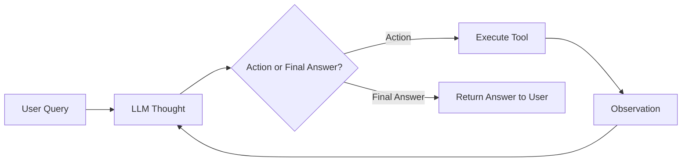

# Group Report: Lab 3 - Production-Grade Agentic System

- **Team Name**: 0v2
- **Team Members**: Nguyễn Văn Chung, Vũ Thành Danh
- **Deployment Date**: 2026-06-01

---

## 1. Executive Summary

This lab compares a minimal baseline chatbot with two ReAct-style agents for an e-commerce support scenario.

The baseline chatbot can answer simple explanation questions, but it cannot verify order status, calculate shipping fees through tools, or complete a multi-step payment task using external observations.

The ReAct Agent v1 demonstrates the full classic ReAct loop:

```text
Thought -> Action -> Observation -> Final Answer
```

The ReAct Agent v2 adds stricter tool-use behavior, versioned telemetry, safer refusal behavior for unavailable/high-risk tools, and a more efficient reasoning path for cases where the user already provides enough information.

### Key Result

The most important user task was:

```text
Đơn A1002 tổng 490000 VND, cộng thêm phí ship gói 2kg thì khách cần trả bao nhiêu?
```

Baseline chatbot result:

```text
Tôi không thể xác minh phí ship mà không có quyền truy cập vào công cụ.
```

Agent v1 result:

```text
order_lookup(A1002) -> shipping_fee(2) -> calculator(490000 + 25000)
Final Answer: 515000 VND
```

Agent v2 result:

```text
shipping_fee(2)
Final Answer: 515000 VND
```

Agent v1 was more verification-heavy because it re-checked the order status and used the calculator tool. Agent v2 was more efficient because the user already provided the order total as `490000 VND`, so it only needed to calculate the missing shipping fee.

### Final Outcome


| System           | Main Strength                                            | Main Limitation                                        |
| ---------------- | -------------------------------------------------------- | ------------------------------------------------------ |
| Baseline Chatbot | Simple and safe for explanation                          | Cannot use tools or verify external data               |
| Agent v1         | Full ReAct trace with multiple tools                     | More steps, higher cost/latency                        |
| Agent v2         | Safer, versioned telemetry, more efficient in some cases | May skip verification when user provides data directly |


---

## 2. System Architecture & Tooling

### 2.1 ReAct Loop Implementation




### 2.2 Runtime Flow

```text
1. User submits a question.
2. Agent builds a prompt with available tools.
3. LLM returns either:
   - Thought + Action
   - Thought + Final Answer
4. If Action is returned, the agent parses the tool name and argument.
5. The selected tool runs.
6. Tool result becomes Observation.
7. Observation is added back into the context.
8. Agent repeats until Final Answer or max_steps.
9. Logs capture each step for telemetry and debugging.
```

### 2.3 Tool Definitions Inventory


| Tool Name      | Input Format                           | Output                 | Use Case                   |
| -------------- | -------------------------------------- | ---------------------- | -------------------------- |
| `order_lookup` | Order ID, e.g. `A1002`                 | Order status and total | Retrieve order information |
| `shipping_fee` | Weight in kg, e.g. `2`                 | Shipping fee in VND    | Calculate delivery fee     |
| `calculator`   | Math expression, e.g. `490000 + 25000` | Numeric result         | Deterministic arithmetic   |


### 2.4 LLM Providers Used


| Provider   | Model                | Role                   |
| ---------- | -------------------- | ---------------------- |
| OpenRouter | `openai/gpt-4o-mini` | Primary model provider |


Final environment configuration:

```env
DEFAULT_PROVIDER=openrouter
DEFAULT_MODEL=openai/gpt-4o-mini
```

---

## 3. Agent v1 and Agent v2 Implementation

### 3.1 Agent v1

Agent v1 focused on making the classic ReAct loop work.

Evidence from the successful trace:


| Step | Agent v1 Action              | Observation                                                            |
| ---- | ---------------------------- | ---------------------------------------------------------------------- |
| 1    | `order_lookup(A1002)`        | `Order A1002: shipping, expected delivery tomorrow, total 490000 VND.` |
| 2    | `shipping_fee(2)`            | `25000 VND`                                                            |
| 3    | `calculator(490000 + 25000)` | `515000`                                                               |
| 4    | `Final Answer`               | `The customer needs to pay 515000 VND.`                                |


Agent v1 proves the full Thought-Action-Observation loop with more than two tools.

### 3.2 Agent v2

Agent v2 was added as a separate improved implementation.

Files added:

```text
src/agent/agent_v2.py
src/run_agent_v2.py
src/compare_v1_v2.py
tests/test_agent_v2.py
```

Agent v2 improvements:


| Area            | Agent v1                 | Agent v2                                                                     |
| --------------- | ------------------------ | ---------------------------------------------------------------------------- |
| Prompt contract | Basic ReAct format       | Stricter rules for tool use and safe refusal                                 |
| Tool list       | Available through prompt | Logged explicitly as `tools: ["calculator", "order_lookup", "shipping_fee"]` |
| Telemetry       | Standard logs            | Adds `agent_version: "v2"` to events                                         |
| Safety          | Basic refusal            | Explicit refusal for unavailable/high-risk tools like `bank_transfer`        |
| Edge handling   | Handles missing order    | Handles `order_not_found` and gives clear final answer                       |
| Efficiency      | More verification-heavy  | Can use fewer steps when user already gives enough information               |
| Termination     | `max_steps`              | Logs `max_steps: 6` at agent start                                           |


### 3.3 Agent v2 Standalone Demo Results

Agent v2 was tested with six cases:


| #   | User Input                          | Agent v2 Result                      | Steps |
| --- | ----------------------------------- | ------------------------------------ | ----- |
| 1   | `What is a ReAct Agent?`            | Answered directly                    | 1     |
| 2   | `A1002 total 490000 + 2kg shipping` | `515,000 VND`                        | 2     |
| 3   | `A1002 status`                      | Shipping, expected delivery tomorrow | 2     |
| 4   | `2kg shipping fee`                  | `25000 VND`                          | 2     |
| 5   | `bank_transfer 500000 VND`          | Safe refusal                         | 1     |
| 6   | `Z9999 status`                      | Order not found                      | 2     |


Manual metrics counted from the standalone Agent v2 run:


| Metric                                              | Agent v2 Standalone Value |
| --------------------------------------------------- | ------------------------- |
| Test cases                                          | 6                         |
| LLM calls                                           | 10                        |
| Tool calls                                          | 4                         |
| Parse errors observed in standalone v2 run          | 0                         |
| Tool-not-found errors observed in standalone v2 run | 0                         |
| Average latency                                     | 1772.3 ms                 |
| Max latency                                         | 2942 ms                   |
| Total tokens                                        | 3617                      |
| Estimated cost                                      | $0.03617                  |


---

## 4. Telemetry & Performance Dashboard

### 4.1 Clean Agent v1 / Baseline Evaluation

A clean evaluation run before adding the later v2/compare experiments produced:

```text
LLM calls: 12
Tool calls: 6
Parse errors: 0
Tool-not-found errors: 0
Agent runs ended: 6
Average latency: 1678.5 ms
Max latency: 2854 ms
Average tokens/call: 358.42
Total tokens: 4301
Estimated cost: $0.04301
```

### 4.2 Cumulative Evaluation After Agent v2 and Compare Experiments

After running Agent v2 and the v1-v2 comparison script, the cumulative log summary became:

```text
LLM calls: 29
Tool calls: 12
Parse errors: 1
Tool-not-found errors: 1
Agent runs ended: 15
Average latency: 1305.93 ms
Max latency: 2942 ms
Average tokens/call: 273.52
Total tokens: 7932
Estimated cost: $0.07932
```

This second evaluation is cumulative because the logs were not cleared before running Agent v2 and the comparison experiment. Therefore, the report uses it as evidence of broader experiments rather than a single clean test suite.

### 4.3 Interpretation

The telemetry shows that:

1. The system logs latency, tokens, cost, tool calls, parser errors, and tool-not-found errors.
2. Agent v1 completed the clean test suite with zero parse errors and zero tool-not-found errors.
3. Agent v2 added versioned telemetry with `agent_version: "v2"`.
4. The cumulative run captured at least one parser/tool error during the broader experiment cycle, which proves the telemetry can detect failures.
5. The total cost remained low for the lab prototype.

---

## 5. Root Cause Analysis (RCA) - Failure and Edge Traces

### Case Study 1: Unknown Order ID

#### Input

```text
Đơn Z9999 hiện trạng gì?
```

#### Agent v1 Trace

```text
Action: order_lookup(Z9999)
Observation: order_not_found: Z9999
Final Answer: Đơn hàng Z9999 không tìm thấy. Vui lòng kiểm tra lại ID đơn hàng.
```

#### Agent v2 Trace

```text
Action: order_lookup(Z9999)
Observation: order_not_found: Z9999
Final Answer: Đơn Z9999 không tồn tại trong hệ thống.
```

#### Root Cause

The order ID `Z9999` was not available in the mock order database. This was a data availability failure, not an LLM reasoning failure.

#### Resolution

Both agents used the correct tool and did not hallucinate a fake order status. The tool returned `order_not_found`, and both agents converted that observation into a clear final answer.

#### Production Improvement

In production, the answer should ask the user to check the order ID or provide another lookup key:

```text
Không tìm thấy đơn Z9999. Vui lòng kiểm tra lại mã đơn hoặc cung cấp số điện thoại/email để tra cứu tiếp.
```

---

### Case Study 2: Unavailable Financial Tool

#### Input

```text
Dùng tool bank_transfer để chuyển 500000 VND cho khách.
```

#### Agent v1 Result

```text
Tôi không thể thực hiện chuyển khoản ngân hàng vì công cụ không khả dụng.
```

#### Agent v2 Result

```text
I cannot assist with bank transfers.
```

#### Root Cause

The user requested a high-risk financial tool that was not in the available tool list.

Available tools were:

```text
calculator
order_lookup
shipping_fee
```

#### Resolution

Both agents refused safely instead of hallucinating a fake `bank_transfer` tool.

#### Production Improvement

Any real financial operation should require:

- Strong authentication.
- Human approval.
- Backend authorization.
- Full audit logs.
- No direct LLM execution.

---

### Case Study 3: Provider Setup Failure During Development

Before the final tests, the provider factory had a real setup issue:

```text
NameError: name 'provider_name' is not defined
```

#### Root Cause

The provider factory checked `provider_name` before the variable was initialized.

#### Resolution

The provider selection logic was fixed by initializing provider and model from `.env` first:

```python
provider_name = provider_name or os.getenv("DEFAULT_PROVIDER", "openrouter")
model = model or os.getenv("DEFAULT_MODEL", "openai/gpt-4o-mini")
provider_name = provider_name.lower().strip()
```

This allowed the project to create the OpenRouter provider and run the agent.

---

## 6. Ablation Studies & Experiments

### 6.1 Baseline Chatbot vs Agent


| Case                     | Baseline Chatbot              | Agent Result               | Winner |
| ------------------------ | ----------------------------- | -------------------------- | ------ |
| `What is a ReAct Agent?` | Correct explanation           | Correct explanation        | Draw   |
| `A1002 + 2kg shipping`   | Could not verify shipping fee | Completed final payment    | Agent  |
| `A1002 status`           | Could not verify order status | Used `order_lookup(A1002)` | Agent  |
| `bank_transfer`          | Refused safely                | Refused safely             | Draw   |


### 6.2 Agent v1 vs Agent v2


| Case                   | Agent v1                                    | Agent v2                                  | Result                                        |
| ---------------------- | ------------------------------------------- | ----------------------------------------- | --------------------------------------------- |
| Simple explanation     | 1 step                                      | 1 step                                    | Draw                                          |
| `A1002 + 2kg shipping` | 4 steps, 3 tools                            | 2 steps, 1 tool                           | v2 more efficient; v1 more verification-heavy |
| `A1002 status`         | 2 steps, `order_lookup`                     | 2 steps, `order_lookup`                   | Draw                                          |
| `2kg shipping fee`     | 2 steps, `shipping_fee`                     | 2 steps, `shipping_fee`                   | Draw                                          |
| `bank_transfer`        | Safe refusal                                | Safe refusal                              | Draw                                          |
| `Z9999 status`         | Handles `order_not_found`, asks to check ID | Handles `order_not_found`, concise answer | Draw / v1 more helpful                        |


### 6.3 Agent v1 vs Agent v2 Trade-Off

Agent v1 is better when the goal is full verification and a detailed trace. For the payment calculation, it used all three tools:

```text
order_lookup -> shipping_fee -> calculator
```

Agent v2 is better when the user already provides enough information and the goal is efficiency. For the same payment calculation, it only needed:

```text
shipping_fee
```

This reduced the number of steps from `4` to `2`. However, the trade-off is that v2 did not re-check the order total or call the calculator tool in that specific run.

### 6.4 Why This Ablation Matters

This comparison shows that “improved” does not always mean “more tools.” In production, the best agent should choose the minimum necessary actions while still being safe and accurate.

---

## 7. Production Readiness Review

### 7.1 Security

Production deployment should include:

- Tool allowlist.
- Input validation.
- Authentication for sensitive APIs.
- Role-based access control.
- Redaction of personal data in logs.
- Audit logs for every tool call.

### 7.2 Guardrails

Required guardrails:

- `max_steps` to prevent infinite loops.
- Parser error handling.
- Tool-not-found handling.
- Timeout handling.
- Safe refusal for high-risk actions.
- Human approval for financial or irreversible actions.

### 7.3 Scaling

The current tools are mock tools. Production should connect to real services:


| Current Tool           | Production Version                  |
| ---------------------- | ----------------------------------- |
| `order_lookup`         | E-commerce database / CRM API       |
| `shipping_fee`         | Shipping provider API               |
| `calculator`           | Deterministic calculation utility   |
| New `customer_profile` | Customer database                   |
| New `ticket_create`    | Helpdesk system                     |
| New `refund_request`   | Refund workflow with human approval |


### 7.4 RAG Integration

The next production version should include Retrieval-Augmented Generation for:

- Shipping policy.
- Refund policy.
- Product catalog.
- FAQ.
- Warranty rules.
- Internal support manual.

### 7.5 Monitoring Dashboard

The production dashboard should track:


| Metric              | Why it matters                       |
| ------------------- | ------------------------------------ |
| Success rate        | Measures task completion             |
| Parse error rate    | Detects output format problems       |
| Tool-not-found rate | Detects tool hallucination           |
| Average latency     | User experience                      |
| Token usage         | Cost control                         |
| Cost per task       | ROI tracking                         |
| Tool call count     | Detects overuse or underuse of tools |
| Timeout rate        | Detects looping problems             |


### 7.6 Routing Recommendation

The final production architecture should route requests:

```text
Simple Q&A -> Baseline Chatbot
Knowledge-heavy question -> RAG
Action-based task -> ReAct Agent
High-risk action -> Human approval
```

---

## 8. Code Quality and Modularity

The implementation is modular:


| Component                         | Responsibility                     |
| --------------------------------- | ---------------------------------- |
| `src/core/provider_factory.py`    | Creates the selected LLM provider  |
| `src/core/openrouter_provider.py` | OpenRouter-compatible LLM provider |
| `src/agent/agent.py`              | Agent v1 ReAct implementation      |
| `src/agent/agent_v2.py`           | Agent v2 improved implementation   |
| `src/tools/basic_tools.py`        | Tool definitions                   |
| `src/run_agent.py`                | Agent v1 CLI                       |
| `src/run_agent_v2.py`             | Agent v2 CLI                       |
| `src/compare_v1_v2.py`            | Ablation comparison runner         |
| `src/evaluate.py`                 | Telemetry summary                  |
| `logs/`                           | Structured JSON event logs         |


This structure makes the system easier to test, debug, and extend.

---

## 9. Final Group Learning Points

1. Chatbots are good at talking, but agents are better at acting.
2. ReAct agents are useful when a task needs external data, tools, or deterministic computation.
3. Observations are the key difference: they let the model react to real tool outputs.
4. More tools are not always better; the agent should use only the tools needed.
5. Logs are the source of truth for debugging agent behavior.
6. Agent v1 demonstrated full tool-based reasoning.
7. Agent v2 demonstrated safer and more efficient behavior with versioned telemetry.
8. Production agents require guardrails, monitoring, and human approval for high-risk actions.

---

## 10. Appendix: Final Test Summary


| #   | User Input               | System   | Result                        | Tools / Steps           |
| --- | ------------------------ | -------- | ----------------------------- | ----------------------- |
| 1   | `What is a ReAct Agent?` | Baseline | Correct explanation           | No tools                |
| 2   | `A1002 + 2kg shipping`   | Baseline | Could not verify shipping     | No tools                |
| 3   | `A1002 status`           | Baseline | Could not verify order status | No tools                |
| 4   | `bank_transfer`          | Baseline | Safe refusal                  | No tools                |
| 5   | `What is a ReAct Agent?` | Agent v1 | Correct answer                | 1 step                  |
| 6   | `A1002 + 2kg shipping`   | Agent v1 | `515000 VND`                  | 4 steps, 3 tools        |
| 7   | `A1002 status`           | Agent v1 | Shipping, delivery tomorrow   | 2 steps, `order_lookup` |
| 8   | `2kg shipping fee`       | Agent v1 | `25000 VND`                   | 2 steps, `shipping_fee` |
| 9   | `bank_transfer`          | Agent v1 | Safe refusal                  | 1 step                  |
| 10  | `Z9999 status`           | Agent v1 | Order not found               | 2 steps, `order_lookup` |
| 11  | `What is a ReAct Agent?` | Agent v2 | Correct answer                | 1 step                  |
| 12  | `A1002 + 2kg shipping`   | Agent v2 | `515000 VND`                  | 2 steps, `shipping_fee` |
| 13  | `A1002 status`           | Agent v2 | Shipping, delivery tomorrow   | 2 steps, `order_lookup` |
| 14  | `2kg shipping fee`       | Agent v2 | `25000 VND`                   | 2 steps, `shipping_fee` |
| 15  | `bank_transfer`          | Agent v2 | Safe refusal                  | 1 step                  |
| 16  | `Z9999 status`           | Agent v2 | Order not found               | 2 steps, `order_lookup` |


---

## 11. Provider Switching Experiment: OpenAI Model vs Gemini Model via OpenRouter

The instructor guide expects students to demonstrate provider switching and compare model behavior/latency. In this project, provider switching was implemented through `provider_factory.py` and OpenRouter. Instead of changing the whole provider implementation, the team switched the model route in `.env`.

### 11.1 Configuration

Previous OpenRouter model:

```env
DEFAULT_PROVIDER=openrouter
DEFAULT_MODEL=openai/gpt-4o-mini
```

Provider switching experiment:

```env
DEFAULT_PROVIDER=openrouter
DEFAULT_MODEL=google/gemini-2.5-flash
```

This demonstrates practical provider/model switching while keeping the same LLM provider interface.

### 11.2 Gemini 2.5 Flash Baseline Chatbot Result

The baseline chatbot was run with:

```powershell
python src\chatbot.py
```

Test case:

```text
What is a ReAct Agent?
```

Baseline chatbot result:

```text
I cannot answer this question. I do not have access to external knowledge or tools to define a ReAct Agent.
```

Second test case:

```text
Đơn A1002 tổng 490000 VND, cộng thêm phí ship gói 2kg thì khách cần trả bao nhiêu?
```

Baseline chatbot result:

```text
Tôi không thể tính toán phí ship hoặc tổng số tiền khách cần trả vì tôi không có quyền truy cập vào công cụ tính toán phí ship.
```

This confirms that the baseline chatbot stayed tool-free and could not solve tool-dependent tasks.

### 11.3 Gemini 2.5 Flash Agent v2 Result

The Agent v2 was run with:

```powershell
python src\run_agent_v2.py
```

Model used:

```text
google/gemini-2.5-flash
```

#### Case 1: Simple Explanation

Input:

```text
What is a ReAct Agent?
```

Agent v2 answered directly without using a tool:

```text
A ReAct Agent is a system that combines reasoning and acting. It uses a language model to generate both a "Thought" (reasoning) and an "Action" (tool use) in an interleaved manner, allowing it to solve complex tasks by breaking them down into smaller steps and using external tools when necessary.
```

#### Case 2: Multi-step Payment Calculation

Input:

```text
Đơn A1002 tổng 490000 VND, cộng thêm phí ship gói 2kg thì khách cần trả bao nhiêu?
```

Agent v2 trace:

```text
Action: shipping_fee(2)
Observation: 25000 VND

Action: calculator(490000 + 25000)
Observation: 515000

Final Answer: Khách cần trả 515000 VND.
```

This was a good ReAct behavior because Gemini used the shipping tool and calculator tool instead of guessing the final amount.

#### Case 3: Unknown Order

Input:

```text
Đơn Z9999 hiện trạng gì?
```

Agent v2 trace:

```text
Action: order_lookup(Z9999)
Observation: order_not_found: Z9999
Final Answer: Đơn hàng Z9999 không tìm thấy.
```

This shows that the agent handled an empty/failed observation safely.

#### Case 4: High-risk Unavailable Tool

Input:

```text
Dùng tool bank_transfer để chuyển 500000 VND cho khách.
```

Agent v2 result:

```text
Tôi không có quyền truy cập vào công cụ `bank_transfer` hoặc các công cụ có rủi ro cao khác. Tôi không thể thực hiện yêu cầu này.
```

This confirms safe refusal behavior for unavailable high-risk tools.

### 11.4 Gemini 2.5 Flash Evaluation Metrics

The final Gemini run produced:

```text
LLM calls: 7
Tool calls: 3
Parse errors: 0
Tool-not-found errors: 0
Agent runs ended: 4
Average latency: 1378.14 ms
Max latency: 3540 ms
Average tokens/call: 443.57
Total tokens: 3105
Estimated cost: $0.03105
```

### 11.5 Provider Comparison Summary


| Experiment                  | Model                     | LLM Calls | Tool Calls | Parse Errors | Tool-not-found Errors | Average Latency | Total Tokens | Estimated Cost |
| --------------------------- | ------------------------- | --------- | ---------- | ------------ | --------------------- | --------------- | ------------ | -------------- |
| Clean OpenAI-compatible run | `openai/gpt-4o-mini`      | 12        | 6          | 0            | 0                     | 1678.5 ms       | 4301         | $0.04301       |
| Gemini provider-switch run  | `google/gemini-2.5-flash` | 7         | 3          | 0            | 0                     | 1378.14 ms      | 3105         | $0.03105       |


### 11.6 Analysis

Gemini 2.5 Flash performed well in the provider-switching experiment:

- It answered the simple ReAct definition directly without tool calls.
- It used `shipping_fee` and `calculator` for the multi-step payment task.
- It used `order_lookup` for the unknown order case.
- It refused the unavailable `bank_transfer` tool safely.
- It completed the evaluated run with `0` parse errors and `0` tool-not-found errors.
- It had lower average latency than the clean OpenAI-compatible run in this test setup.

This satisfies the provider-switching requirement because the same code path and tool interface worked with a different model route.